STREJARU MIHAI-CRISTIAN

Cuprins

[1. Utilitatea bazei de date](#utilitatea-bazei-de-date)

[2. Diagrama entitate-relatie](#diagrama-entitate-relatie)

[3. Diagrama conceptuala](#diagrama-conceptuala)

[4. Implementarea diagramei conceptuale](#implementarea-diagramei-conceptuale)

[5. Adaugare informatii](#adaugare-informatii)

[6. Problema rezolvata folosind un subprogram stocat independent cu 3 tipuri de colectii](#problema-rezolvata-folosind-un-subprogram-stocat-independent-cu-3-tipuri-de-colectii)

[7. Problema rezolvata folosind un subprogram stocat independent cu 2 tipuri de cursoare](#problema-rezolvata-folosind-un-subprogram-stocat-independent-cu-2-tipuri-de-cursoare)

[8. Problema rezolvata folosind un subprogram stocat independent de tip functie, utilizand 3 tabele](#problema-rezolvata-folosind-un-subprogram-stocat-independent-de-tip-functie-utilizand-3-tabele)

[9. Problema rezolvata folosind un subprogram stocat independent de tip procedura, utilizand 5 tabele](#problema-rezolvata-folosind-un-subprogram-stocat-independent-de-tip-procedura-utilizand-5-tabele)

[10. Trigger de tip LMD la nivel de comanda](#trigger-de-tip-lmd-la-nivel-de-comanda)

[11. Trigger de tip LMD la nivel de linie](#trigger-de-tip-lmd-la-nivel-de-linie)

[12. Trigger de tip LDD](#trigger-de-tip-ldd)

[13. Pachet care continue toate obiectele definite in cadrul proiectului](#pachet-care-continue-toate-obiectele-definite-in-cadrul-proiectului)

## Utilitatea bazei de date

Modelul de date este un sistem de gestionare a stocului și vânzărilor pentru o companie care comercializează produse electronice. O prezentare scurtă a tabelelor și relațiilor din baza de date este următoarea:

1\. LOCATIE:

\- Stochează informații despre locațiile fizice ale depozitelor.

\- Atributele includ: id_locatie, judet, oras, strada, numar_strada.

2\. DEPOZIT:

\- Conține detalii despre depozite, inclusiv capacitatea lor.

\- Atributele includ: id_depozit, id_locatie, denumire, capacitate.

3\. MODEL_PRODUS:

\- Menține informații despre produsele disponibile în depozite.

\- Atributele includ: id_model_cuprins, id_depozit, stoc, denumire, producator, pret.

4\. COMENTARIU:

\- Folosit pentru a stoca comentarii legate de produse.

\- Atributele includ: id_comentariu, likeuri.

5\. CLIENT:

\- Conține informații despre clienți.

\- Atributele includ: id_client, nume, prenume, email.

6\. COMANDA:

\- Urmărește detaliile comenzilor plasate de clienți.

\- Atributele includ: id_comanda, id_client, numar_produse, data, valoare.

7\. PRODUS_CUPRINS:

\- Relaționează comenzile cu produsele specifice.

\- Atributele includ: id_comanda, id_model_produs.

8\. LIVRATOR:

\- Stochează informații despre livratori.

\- Atributele includ: id_livrator, nume, prenume.

9\. RIDICARE:

\- Conține date despre ridicarea produselor de către livratori.

\- Atributele includ: id_model_produs, id_livrator, data.

10\. VEHICUL_DE_TRANSPORT:

\- Specifică vehiculele folosite de livratori.

\- Atributele includ: id_masina, id_livrator, model, autonomie.

11\. RECENZIE:

\- Păstrează recenzii ale clienților pentru produse.

\- Atributele includ: id_recenzie, id_comentariu, id_client, id_model_produs, stele.

12\. LIVRARE:

\- Urmărește informații despre livrările efectuate către clienți.

\- Atributele includ: id_livrator, id_client, data.

Această bază de date este utilă pentru monitorizarea stocului, gestionarea comenzilor și a livrărilor, precum și pentru colectarea feedback-ului de la clienți prin comentarii și recenzii. Relațiile dintre tabele permit o gestionare eficientă a datelor legate de operațiunile comerciale și interacțiunile cu clienții.

## Diagrama entitate-relatie

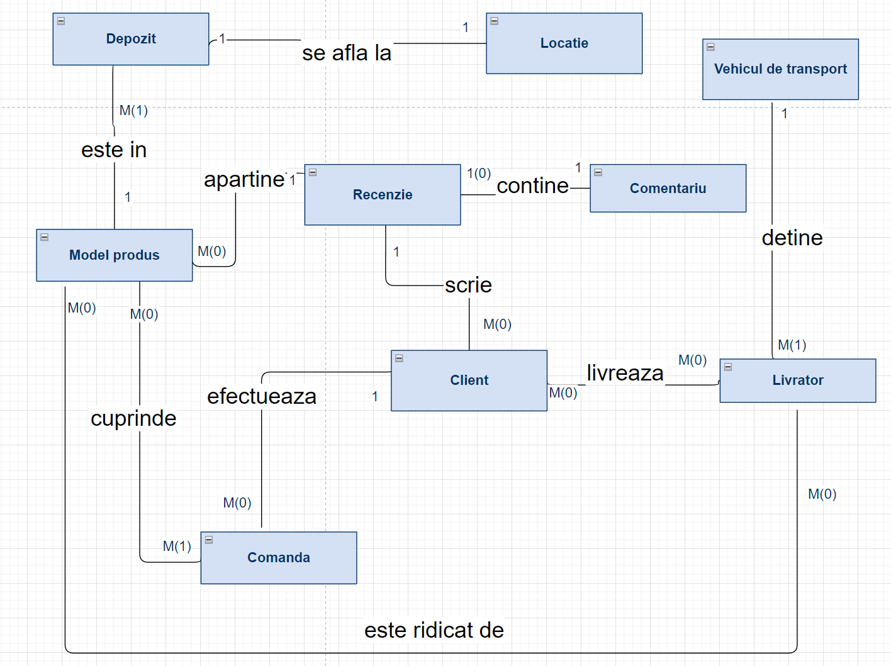

## Diagrama conceptuala

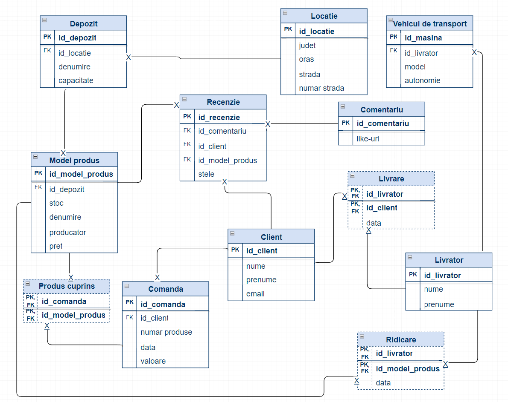

## Implementarea diagramei conceptuale

| CREATE TABLE LOCATIE (  id_locatie INT PRIMARY KEY,  judet VARCHAR(255),  oras VARCHAR(255),  strada VARCHAR(255),  numar_strada VARCHAR(255) );  CREATE TABLE DEPOZIT (  id_depozit INT PRIMARY KEY,  id_locatie INT,  denumire VARCHAR(255),  capacitate INT,  FOREIGN KEY (id_locatie) REFERENCES LOCATIE(id_locatie) );  CREATE TABLE MODEL_PRODUS (  id_model_cuprins INT PRIMARY KEY,  id_depozit INT,  stoc INT,  denumire VARCHAR(255),  producator VARCHAR(255),  pret DECIMAL(10, 2),  FOREIGN KEY (id_depozit) REFERENCES DEPOZIT(id_depozit) );  CREATE TABLE COMENTARIU (  id_comentariu INT PRIMARY KEY,  likeuri INT );  CREATE TABLE CLIENT (  id_client INT PRIMARY KEY,  nume VARCHAR(255),  prenume VARCHAR(255),  email VARCHAR(255) );  CREATE TABLE COMANDA (  id_comanda INT PRIMARY KEY,  id_client INT,  numar_produse INT,  data DATE,  valoare DECIMAL(10, 2),  FOREIGN KEY (id_client) REFERENCES CLIENT(id_client) );  CREATE TABLE PRODUS_CUPRINS (  id_comanda INT,  id_model_produs INT,  PRIMARY KEY (id_comanda, id_model_produs),  FOREIGN KEY (id_comanda) REFERENCES COMANDA(id_comanda),  FOREIGN KEY (id_model_produs) REFERENCES MODEL_PRODUS(id_model_cuprins) );  CREATE TABLE LIVRATOR (  id_livrator INT PRIMARY KEY,  nume VARCHAR(255),  prenume VARCHAR(255) );  CREATE TABLE RIDICARE (  id_model_produs INT,  id_livrator INT,  data DATE,  PRIMARY KEY (id_model_produs, id_livrator),  FOREIGN KEY (id_model_produs) REFERENCES MODEL_PRODUS(id_model_cuprins),  FOREIGN KEY (id_livrator) REFERENCES LIVRATOR(id_livrator) );  CREATE TABLE VEHICUL_DE_TRANSPORT (  id_masina INT PRIMARY KEY,  id_livrator INT,  model VARCHAR(255),  autonomie INT,  FOREIGN KEY (id_livrator) REFERENCES LIVRATOR(id_livrator) );  CREATE TABLE RECENZIE (  id_recenzie INT PRIMARY KEY,  id_comentariu INT,  id_client INT,  id_model_produs INT,  stele INT,  FOREIGN KEY (id_comentariu) REFERENCES COMENTARIU(id_comentariu),  FOREIGN KEY (id_client) REFERENCES CLIENT(id_client),  FOREIGN KEY (id_model_produs) REFERENCES MODEL_PRODUS(id_model_cuprins) );  CREATE TABLE LIVRARE (  id_livrator INT,  id_client INT,  data DATE,  PRIMARY KEY (id_livrator, id_client),  FOREIGN KEY (id_livrator) REFERENCES LIVRATOR(id_livrator),  FOREIGN KEY (id_client) REFERENCES CLIENT(id_client) ); |
|------------------------------------------------------------------------------------------------------------------------------------------------------------------------------------------------------------------------------------------------------------------------------------------------------------------------------------------------------------------------------------------------------------------------------------------------------------------------------------------------------------------------------------------------------------------------------------------------------------------------------------------------------------------------------------------------------------------------------------------------------------------------------------------------------------------------------------------------------------------------------------------------------------------------------------------------------------------------------------------------------------------------------------------------------------------------------------------------------------------------------------------------------------------------------------------------------------------------------------------------------------------------------------------------------------------------------------------------------------------------------------------------------------------------------------------------------------------------------------------------------------------------------------------------------------------------------------------------------------------------------------------------------------------------------------------------------------------------------------------------------------------------------------------------------------------------------------------------------------------------------------------------------------------------------------------------------------------------------------------------------------------------------------------------------------------------------------------------------------------------------------------------------------------------------------------------------------------------------------------------------------------------------------------------------------------------------------------------|

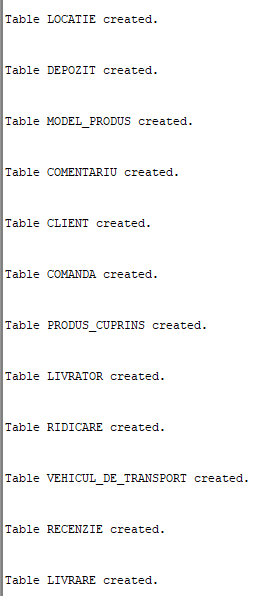

## Adaugare informatii

| INSERT INTO LOCATIE (id_locatie, judet, oras, strada, numar_strada) VALUES (1, 'Bucharest', 'Bucharest', 'Main Street', '123');  INSERT INTO LOCATIE (id_locatie, judet, oras, strada, numar_strada) VALUES (2, 'Ilfov', 'Voluntari', 'Central Street', '456');  INSERT INTO LOCATIE (id_locatie, judet, oras, strada, numar_strada) VALUES (3, 'Cluj', 'Cluj-Napoca', 'Victory Street', '789');  INSERT INTO LOCATIE (id_locatie, judet, oras, strada, numar_strada) VALUES (4, 'Timis', 'Timisoara', 'Freedom Street', '101');  INSERT INTO LOCATIE (id_locatie, judet, oras, strada, numar_strada) VALUES (5, 'Constanta', 'Constanta', 'Seaside Street', '202');  INSERT INTO DEPOZIT (id_depozit, id_locatie, denumire, capacitate) VALUES (101, 1, 'Main Depot', 500);  INSERT INTO DEPOZIT (id_depozit, id_locatie, denumire, capacitate) VALUES (102, 2, 'Central Warehouse', 300);  INSERT INTO DEPOZIT (id_depozit, id_locatie, denumire, capacitate) VALUES (103, 3, 'Victory Storage', 700);  INSERT INTO DEPOZIT (id_depozit, id_locatie, denumire, capacitate) VALUES (104, 4, 'Freedom Stockroom', 400);  INSERT INTO DEPOZIT (id_depozit, id_locatie, denumire, capacitate) VALUES (105, 5, 'Seaside Depot', 600);  INSERT INTO MODEL_PRODUS (id_model_cuprins, id_depozit, stoc, denumire, producator, pret) VALUES (1001, 101, 50, 'Laptop', 'ABC Electronics', 1200.00);  INSERT INTO MODEL_PRODUS (id_model_cuprins, id_depozit, stoc, denumire, producator, pret) VALUES (1002, 102, 30, 'Smartphone', 'XYZ Tech', 800.00);  INSERT INTO MODEL_PRODUS (id_model_cuprins, id_depozit, stoc, denumire, producator, pret) VALUES (1003, 103, 80, 'Camera', 'CameraCo', 300.00);  INSERT INTO MODEL_PRODUS (id_model_cuprins, id_depozit, stoc, denumire, producator, pret) VALUES (1004, 104, 40, 'Headphones', 'AudioTech', 150.00);  INSERT INTO MODEL_PRODUS (id_model_cuprins, id_depozit, stoc, denumire, producator, pret) VALUES (1005, 105, 60, 'Tablet', 'TechGadget', 500.00);  INSERT INTO COMENTARIU (id_comentariu, likeuri) VALUES (501, 10);  INSERT INTO COMENTARIU (id_comentariu, likeuri) VALUES (502, 5);  INSERT INTO COMENTARIU (id_comentariu, likeuri) VALUES (503, 15);  INSERT INTO COMENTARIU (id_comentariu, likeuri) VALUES (504, 8);  INSERT INTO COMENTARIU (id_comentariu, likeuri) VALUES (505, 12);  INSERT INTO CLIENT (id_client, nume, prenume, email) VALUES (201, 'John', 'Doe', 'john.doe@example.com');  INSERT INTO CLIENT (id_client, nume, prenume, email) VALUES (202, 'Jane', 'Smith', 'jane.smith@example.com');  INSERT INTO CLIENT (id_client, nume, prenume, email) VALUES (203, 'Alex', 'Johnson', 'alex.johnson@example.com');  INSERT INTO CLIENT (id_client, nume, prenume, email) VALUES (204, 'Emily', 'Williams', 'emily.williams@example.com');  INSERT INTO CLIENT (id_client, nume, prenume, email) VALUES (205, 'David', 'Brown', 'david.brown@example.com');  INSERT INTO CLIENT (id_client, nume, prenume, email) VALUES (206, 'Andrew', 'Lee', 'andrew.lee@example.com');  INSERT INTO COMANDA (id_comanda, id_client, numar_produse, data, valoare) VALUES (301, 201, 2, '01-01-2024', 2400.00);  INSERT INTO COMANDA (id_comanda, id_client, numar_produse, data, valoare) VALUES (302, 202, 1, '02-01-2024', 800.00);  INSERT INTO COMANDA (id_comanda, id_client, numar_produse, data, valoare) VALUES (303, 203, 3, '03-01-2024', 900.00);  INSERT INTO COMANDA (id_comanda, id_client, numar_produse, data, valoare) VALUES (304, 204, 1, '04-01-2024', 150.00);  INSERT INTO COMANDA (id_comanda, id_client, numar_produse, data, valoare) VALUES (305, 205, 2, '05-01-2024', 1000.00);  INSERT INTO PRODUS_CUPRINS (id_comanda, id_model_produs) VALUES (301, 1001);  INSERT INTO PRODUS_CUPRINS (id_comanda, id_model_produs) VALUES (302, 1002);  INSERT INTO PRODUS_CUPRINS (id_comanda, id_model_produs) VALUES (303, 1003);  INSERT INTO PRODUS_CUPRINS (id_comanda, id_model_produs) VALUES (304, 1004);  INSERT INTO PRODUS_CUPRINS (id_comanda, id_model_produs) VALUES (305, 1005);  INSERT INTO PRODUS_CUPRINS (id_comanda, id_model_produs) VALUES (301, 1002);  INSERT INTO PRODUS_CUPRINS (id_comanda, id_model_produs) VALUES (302, 1003);  INSERT INTO PRODUS_CUPRINS (id_comanda, id_model_produs) VALUES (302, 1004);  INSERT INTO PRODUS_CUPRINS (id_comanda, id_model_produs) VALUES (303, 1002);  INSERT INTO PRODUS_CUPRINS (id_comanda, id_model_produs) VALUES (303, 1001);  INSERT INTO LIVRATOR (id_livrator, nume, prenume) VALUES (401, 'Michael', 'Smith');  INSERT INTO LIVRATOR (id_livrator, nume, prenume) VALUES (402, 'Laura', 'Johnson');  INSERT INTO LIVRATOR (id_livrator, nume, prenume) VALUES (403, 'Daniel', 'Brown');  INSERT INTO LIVRATOR (id_livrator, nume, prenume) VALUES (404, 'Emma', 'Davis');  INSERT INTO LIVRATOR (id_livrator, nume, prenume) VALUES (405, 'William', 'Jones');  INSERT INTO RIDICARE (id_model_produs, id_livrator, data) VALUES (1001, 401, '06-01-2024');  INSERT INTO RIDICARE (id_model_produs, id_livrator, data) VALUES (1002, 402, '07-01-2024');  INSERT INTO RIDICARE (id_model_produs, id_livrator, data) VALUES (1003, 403, '08-01-2024');  INSERT INTO RIDICARE (id_model_produs, id_livrator, data) VALUES (1004, 404, '09-01-2024');  INSERT INTO RIDICARE (id_model_produs, id_livrator, data) VALUES (1005, 405, '10-01-2024');  INSERT INTO RIDICARE (id_model_produs, id_livrator, data) VALUES (1001, 402, '06-01-2024');  INSERT INTO RIDICARE (id_model_produs, id_livrator, data) VALUES (1002, 403, '07-01-2024');  INSERT INTO RIDICARE (id_model_produs, id_livrator, data) VALUES (1003, 404, '08-01-2024');  INSERT INTO RIDICARE (id_model_produs, id_livrator, data) VALUES (1004, 405, '09-01-2024');  INSERT INTO RIDICARE (id_model_produs, id_livrator, data) VALUES (1005, 404, '10-01-2024');  INSERT INTO VEHICUL_DE_TRANSPORT (id_masina, id_livrator, model, autonomie) VALUES (501, 401, 'Van', 300);  INSERT INTO VEHICUL_DE_TRANSPORT (id_masina, id_livrator, model, autonomie) VALUES (502, 402, 'Car', 250);  INSERT INTO VEHICUL_DE_TRANSPORT (id_masina, id_livrator, model, autonomie) VALUES (503, 403, 'Truck', 400);  INSERT INTO VEHICUL_DE_TRANSPORT (id_masina, id_livrator, model, autonomie) VALUES (504, 404, 'Scooter', 100);  INSERT INTO VEHICUL_DE_TRANSPORT (id_masina, id_livrator, model, autonomie) VALUES (505, 405, 'Bike', 50);  INSERT INTO RECENZIE (id_recenzie, id_comentariu, id_client, id_model_produs, stele) VALUES (601, 501, 201, 1001, 5);  INSERT INTO RECENZIE (id_recenzie, id_comentariu, id_client, id_model_produs, stele) VALUES (602, 502, 202, 1002, 4);  INSERT INTO RECENZIE (id_recenzie, id_comentariu, id_client, id_model_produs, stele) VALUES (603, 503, 203, 1003, 5);  INSERT INTO RECENZIE (id_recenzie, id_comentariu, id_client, id_model_produs, stele) VALUES (604, 504, 204, 1004, 3);  INSERT INTO RECENZIE (id_recenzie, id_comentariu, id_client, id_model_produs, stele) VALUES (605, 505, 205, 1005, 4);  INSERT INTO LIVRARE (id_livrator, id_client, data) VALUES (401, 201, '11-01-2024');  INSERT INTO LIVRARE (id_livrator, id_client, data) VALUES (402, 202, '12-01-2024');  INSERT INTO LIVRARE (id_livrator, id_client, data) VALUES (403, 203, '13-01-2024');  INSERT INTO LIVRARE (id_livrator, id_client, data) VALUES (404, 204, '14-01-2024');  INSERT INTO LIVRARE (id_livrator, id_client, data) VALUES (405, 205, '15-01-2024');  INSERT INTO LIVRARE (id_livrator, id_client, data) VALUES (402, 201, '11-01-2024');  INSERT INTO LIVRARE (id_livrator, id_client, data) VALUES (403, 201, '12-01-2024');  INSERT INTO LIVRARE (id_livrator, id_client, data) VALUES (404, 202, '13-01-2024');  INSERT INTO LIVRARE (id_livrator, id_client, data) VALUES (405, 204, '14-01-2024');  INSERT INTO LIVRARE (id_livrator, id_client, data) VALUES (404, 203, '15-01-2024'); |
|----------------------------------------------------------------------------------------------------------------------------------------------------------------------------------------------------------------------------------------------------------------------------------------------------------------------------------------------------------------------------------------------------------------------------------------------------------------------------------------------------------------------------------------------------------------------------------------------------------------------------------------------------------------------------------------------------------------------------------------------------------------------------------------------------------------------------------------------------------------------------------------------------------------------------------------------------------------------------------------------------------------------------------------------------------------------------------------------------------------------------------------------------------------------------------------------------------------------------------------------------------------------------------------------------------------------------------------------------------------------------------------------------------------------------------------------------------------------------------------------------------------------------------------------------------------------------------------------------------------------------------------------------------------------------------------------------------------------------------------------------------------------------------------------------------------------------------------------------------------------------------------------------------------------------------------------------------------------------------------------------------------------------------------------------------------------------------------------------------------------------------------------------------------------------------------------------------------------------------------------------------------------------------------------------------------------------------------------------------------------------------------------------------------------------------------------------------------------------------------------------------------------------------------------------------------------------------------------------------------------------------------------------------------------------------------------------------------------------------------------------------------------------------------------------------------------------------------------------------------------------------------------------------------------------------------------------------------------------------------------------------------------------------------------------------------------------------------------------------------------------------------------------------------------------------------------------------------------------------------------------------------------------------------------------------------------------------------------------------------------------------------------------------------------------------------------------------------------------------------------------------------------------------------------------------------------------------------------------------------------------------------------------------------------------------------------------------------------------------------------------------------------------------------------------------------------------------------------------------------------------------------------------------------------------------------------------------------------------------------------------------------------------------------------------------------------------------------------------------------------------------------------------------------------------------------------------------------------------------------------------------------------------------------------------------------------------------------------------------------------------------------------------------------------------------------------------------------------------------------------------------------------------------------------------------------------------------------------------------------------------------------------------------------------------------------------------------------------------------------------------------------------------------------------------------------------------------------------------------------------------------------------------------------------------------------------------------------------------------------------------------------------------------------------------------------------------------------------------------------------------------------------------------------------------------------------------------------------------------------------------------------------------------------------------------------------------------------------------------------------------------------------------------------------------------------------------------------------------------------------------------------------------------------------------------------------------------------------------------------------------------------------------------------------------------------------------------------------------------------------------------------------------------------------------------------------------------------------------------------------------------------------------------------------------------------------------------------------------------------------------------------------------------------------------------------------------------------------------------------------------------------------------------------------------------------------------------------------------------------------------------------------------------------------------------------------------------------------------------------------------------------------------------------------------------------------------------------------------------------------------------------------------------------------------------------------------------------------------------------------------------------------------------------------------------------------------------------------------------------------------------------------------------------------------------------------------------------------------------------------------------------------------------------------------------------------------------------------------------------------------------------------------------------------------------------------------------------------------------------------------------------------------------------------------------------------------------------------------------------------------------------------------------------------------------------------------------------------------------------------------------------------------------------------------------------------------------------------------------------------------------------------------------------------------------------------------------------------------------------------------------------------------------------------------------------------------------------------------------------------------------------------------------------------------------------------------------------------------------------------------------------------------------------------------------------------------------------------------|

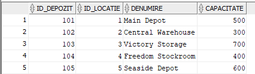

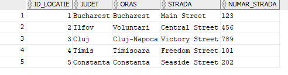

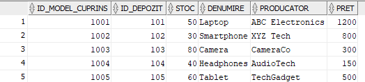

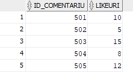

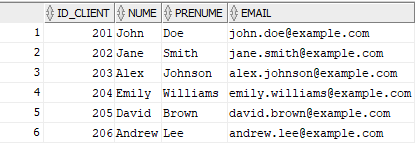

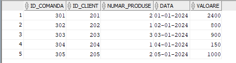

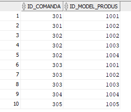

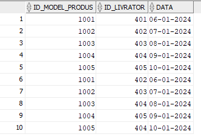

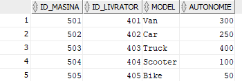

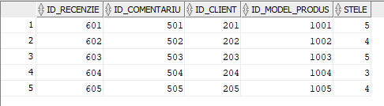

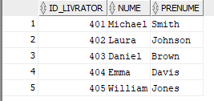

## Problema rezolvata folosind un subprogram stocat independent cu 3 tipuri de colectii

În baza de date, există nevoia de a obține un raport detaliat privind stocurile de produse din fiecare depozit, inclusiv informații despre numărul total de produse și stocurile individuale ale acestora. Această necesitate derivă din faptul că datele despre stocuri sunt dispersate în diferitele înregistrări ale tabelului "MODEL_PRODUS" și o astfel de analiză este dificil de realizat direct dintr-o interogare simplă.

| CREATE OR REPLACE PROCEDURE GetAllDepotInventory AS  TYPE ProductCountIndexByTable IS TABLE OF INT INDEX BY VARCHAR2(255);  TYPE ProductListNestedTable IS TABLE OF VARCHAR2(255);  TYPE StockVarray IS VARRAY(10) OF INT;    TYPE DepotInfoRecord IS RECORD (  DepotId INT,  ProductCount INT,  Products ProductListNestedTable,  Stocks StockVarray  );   TYPE DepotInfoTable IS TABLE OF DepotInfoRecord;  DepotsInfo DepotInfoTable := DepotInfoTable();  CursorDepots SYS_REFCURSOR;  DepotRec DepotInfoRecord; BEGIN  OPEN CursorDepots FOR  SELECT DISTINCT id_depozit FROM MODEL_PRODUS;   LOOP  FETCH CursorDepots INTO DepotRec.DepotId;  EXIT WHEN CursorDepots%NOTFOUND;   DepotRec.Products := ProductListNestedTable();  DepotRec.Stocks := StockVarray();   SELECT COUNT(\*)  INTO DepotRec.ProductCount  FROM MODEL_PRODUS  WHERE id_depozit = DepotRec.DepotId;   FOR ProductRec IN (SELECT denumire FROM MODEL_PRODUS WHERE id_depozit = DepotRec.DepotId) LOOP  DepotRec.Products.EXTEND;  DepotRec.Products(DepotRec.Products.LAST) := ProductRec.denumire;  END LOOP;   FOR StockRec IN (SELECT stoc FROM MODEL_PRODUS WHERE id_depozit = DepotRec.DepotId) LOOP  DepotRec.Stocks.EXTEND;  DepotRec.Stocks(DepotRec.Stocks.LAST) := StockRec.stoc;  END LOOP;   DepotsInfo.EXTEND;  DepotsInfo(DepotsInfo.LAST) := DepotRec;  END LOOP;   CLOSE CursorDepots;   FOR i IN 1..DepotsInfo.COUNT LOOP  DBMS_OUTPUT.PUT_LINE('Depozit: ' \|\| DepotsInfo(i).DepotId);  DBMS_OUTPUT.PUT_LINE('Număr total de produse în depozit: ' \|\| DepotsInfo(i).ProductCount);   FOR j IN 1..DepotsInfo(i).Products.COUNT LOOP  DBMS_OUTPUT.PUT_LINE('Produs: ' \|\| DepotsInfo(i).Products(j) \|\| ', Stoc: ' \|\| DepotsInfo(i).Stocks(j));  END LOOP;   DBMS_OUTPUT.PUT_LINE('');  END LOOP; END; /  EXEC GetAllDepotInventory; |
|-----------------------------------------------------------------------------------------------------------------------------------------------------------------------------------------------------------------------------------------------------------------------------------------------------------------------------------------------------------------------------------------------------------------------------------------------------------------------------------------------------------------------------------------------------------------------------------------------------------------------------------------------------------------------------------------------------------------------------------------------------------------------------------------------------------------------------------------------------------------------------------------------------------------------------------------------------------------------------------------------------------------------------------------------------------------------------------------------------------------------------------------------------------------------------------------------------------------------------------------------------------------------------------------------------------------------------------------------------------------------------------------------------------------------------------------------------------------------------------------------------------------------------------------------------------------------------------------------------------------------------------------------------------------------------------------------------------------------------------------------------------------------------------------------------------------------------------------|

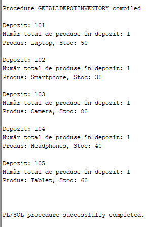

## Problema rezolvata folosind un subprogram stocat independent cu 2 tipuri de cursoare

În baza de date, există o nevoie de a obține informații detaliate despre comenzile efectuate de către clienți într-un anumit interval de timp. Această necesitate derivă din faptul că datele despre comenzile clienților sunt distribuite în diferitele înregistrări ale tabelului "COMANDA" și o astfel de analiză este dificil de realizat direct dintr-o interogare simplă.

| CREATE OR REPLACE PROCEDURE GetCustomerOrders(  p_start_date DATE,  p_end_date DATE ) AS  CURSOR CustomerCursor IS  SELECT id_client, nume, prenume  FROM CLIENT;   CURSOR OrderCursor (v_client_id INT) IS  SELECT id_comanda, numar_produse, data, valoare  FROM COMANDA  WHERE id_client = v_client_id  AND data BETWEEN p_start_date AND p_end_date;   v_client_id INT;  v_client_name VARCHAR2(255);  v_client_surname VARCHAR2(255);  v_order_id INT;  v_order_products INT;  v_order_date DATE;  v_order_value DECIMAL(10, 2); BEGIN  FOR CustomerRec IN CustomerCursor LOOP  v_client_id := CustomerRec.id_client;  v_client_name := CustomerRec.nume;  v_client_surname := CustomerRec.prenume;   DBMS_OUTPUT.PUT_LINE('Detalii pentru clientul cu ID ' \|\| v_client_id \|\| ': ' \|\| v_client_name \|\| ' ' \|\| v_client_surname);   OPEN OrderCursor(v_client_id);   FETCH OrderCursor INTO v_order_id, v_order_products, v_order_date, v_order_value;  IF OrderCursor%NOTFOUND THEN  DBMS_OUTPUT.PUT_LINE('Nicio comandă în intervalul specificat.');  ELSE  LOOP  DBMS_OUTPUT.PUT_LINE('Comanda ID: ' \|\| v_order_id \|\| ', Produse: ' \|\| v_order_products \|\| ', Data: ' \|\| v_order_date \|\| ', Valoare: ' \|\| v_order_value);   FETCH OrderCursor INTO v_order_id, v_order_products, v_order_date, v_order_value;  EXIT WHEN OrderCursor%NOTFOUND;  END LOOP;  END IF;   CLOSE OrderCursor;   DBMS_OUTPUT.PUT_LINE('');  END LOOP; END; /  EXEC GetCustomerOrders('01-01-2024', '31-01-2024'); |
|---------------------------------------------------------------------------------------------------------------------------------------------------------------------------------------------------------------------------------------------------------------------------------------------------------------------------------------------------------------------------------------------------------------------------------------------------------------------------------------------------------------------------------------------------------------------------------------------------------------------------------------------------------------------------------------------------------------------------------------------------------------------------------------------------------------------------------------------------------------------------------------------------------------------------------------------------------------------------------------------------------------------------------------------------------------------------------------------------------------------------------------------------------------------------------------------------------------------------------------------------------------------------------------------------------------------------------------------------------------------------------------------------------------------------------------------------------------------------------------------------------------------------|

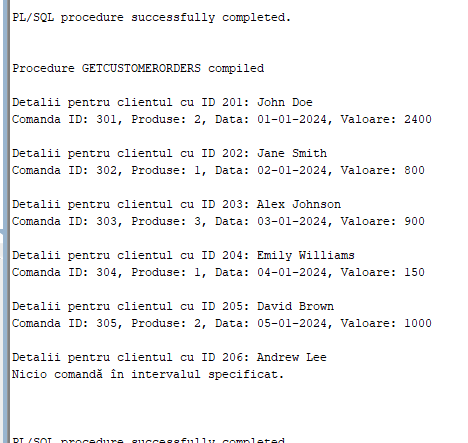

## Problema rezolvata folosind un subprogram stocat independent de tip functie, utilizand 3 tabele

În baza de date, există necesitatea de a furniza informații detaliate despre comenzile unui client specific, inclusiv valoarea totală a acestora și detaliile ultimei comenzi efectuate de către client. Aceasta poate deveni o problemă atunci când se dorește obținerea acestor informații pentru un anumit client, în special dacă clientul nu există în baza de date sau nu a plasat nicio comandă.

| CREATE OR REPLACE FUNCTION GetCustomerOrderDetails(  p_client_id INT ) RETURN VARCHAR2 AS  v_total_value DECIMAL(10, 2);  v_last_order_details VARCHAR2(4000);   NoOrdersException EXCEPTION;  PRAGMA EXCEPTION_INIT(NoOrdersException, -20001);   NoCustomerException EXCEPTION;  PRAGMA EXCEPTION_INIT(NoCustomerException, -20003); BEGIN  SELECT COUNT(\*)  INTO v_total_value  FROM CLIENT  WHERE id_client = p_client_id;   IF v_total_value = 0 THEN  RAISE_APPLICATION_ERROR(-20003, 'Nu există client cu ID-ul specificat.');  END IF;   SELECT NVL(SUM(c.valoare), 0),   MAX('Ultima comanda:' \|\| CHR(10) \|\| 'Comanda ID: ' \|\| c.id_comanda \|\| ', Produse: ' \|\| c.numar_produse \|\| ', Data: ' \|\| TO_CHAR(c.data, 'DD-MM-YYYY')) \|\|  CHR(10) \|\| 'Produse cumparate: ' \|\| CHR(10) \|\|  LISTAGG('Produs: ' \|\| mp.denumire \|\| ', Producator: ' \|\| mp.producator \|\| ', Pret: ' \|\| TO_CHAR(mp.pret, 'FM9999.99'), CHR(10)) WITHIN GROUP (ORDER BY pc.id_comanda)  INTO v_total_value, v_last_order_details  FROM COMANDA c  JOIN PRODUS_CUPRINS pc ON c.id_comanda = pc.id_comanda  JOIN MODEL_PRODUS mp ON pc.id_model_produs = mp.id_model_cuprins  WHERE c.id_client = p_client_id;   IF v_total_value = 0 THEN  RAISE_APPLICATION_ERROR(-20001, 'Clientul nu a făcut nicio comandă.');  END IF;   RETURN 'Valoarea totală a comenzilor: ' \|\| TO_CHAR(v_total_value) \|\| CHR(10) \|\| v_last_order_details; EXCEPTION  WHEN NoOrdersException THEN  RETURN 'Eroare: ' \|\| SQLERRM;  WHEN NoCustomerException THEN  RETURN 'Eroare: ' \|\| SQLERRM;  WHEN OTHERS THEN  RETURN 'Eroare nedefinită: ' \|\| SQLERRM; END; /  DECLARE  v_result VARCHAR2(4000); BEGIN  v_result := GetCustomerOrderDetails(201);  DBMS_OUTPUT.PUT_LINE('Rezultat 1: ' \|\| v_result);   v_result := GetCustomerOrderDetails(206);  DBMS_OUTPUT.PUT_LINE('Rezultat 2: ' \|\| v_result);   v_result := GetCustomerOrderDetails(999);  DBMS_OUTPUT.PUT_LINE('Rezultat 3: ' \|\| v_result); END; / |
|---------------------------------------------------------------------------------------------------------------------------------------------------------------------------------------------------------------------------------------------------------------------------------------------------------------------------------------------------------------------------------------------------------------------------------------------------------------------------------------------------------------------------------------------------------------------------------------------------------------------------------------------------------------------------------------------------------------------------------------------------------------------------------------------------------------------------------------------------------------------------------------------------------------------------------------------------------------------------------------------------------------------------------------------------------------------------------------------------------------------------------------------------------------------------------------------------------------------------------------------------------------------------------------------------------------------------------------------------------------------------------------------------------------------------------------------------------------------------------------------------------------------------------------------------------------------------------------------------------------------------------------------------------------------------------------------------------------------------------------------------------------------------------------------------------------------------------------------------------------------------------------------------------------------------------------------------------------------------------------------------------------------|

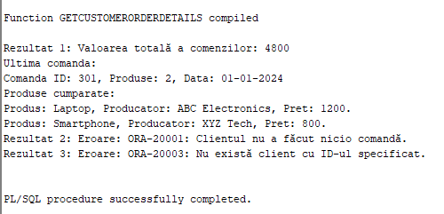

## Problema rezolvata folosind un subprogram stocat independent de tip procedura, utilizand 5 tabele

În baza de date, o problemă care poate apărea este legată de plasarea comenzilor pentru produse care nu există în baza de date sau pentru care stocul disponibil este insuficient pentru a satisface cantitatea solicitată de către client.

| CREATE SEQUENCE seq_comanda START WITH 1 INCREMENT BY 1;  CREATE OR REPLACE PROCEDURE plaseaza_comanda(  p_id_client INT,  p_denumire_produs VARCHAR2,  p_cantitate INT ) AS  v_id_locatie INT;  v_stoc_disponibil INT;  v_id_comanda INT;  v_pret_unitar DECIMAL(10, 2);  v_valoare DECIMAL(10, 2); BEGIN  SELECT dp.id_locatie  INTO v_id_locatie  FROM MODEL_PRODUS mp  JOIN DEPOZIT dp ON mp.id_depozit = dp.id_depozit  WHERE mp.denumire = p_denumire_produs;   SELECT stoc, pret  INTO v_stoc_disponibil, v_pret_unitar  FROM MODEL_PRODUS  WHERE denumire = p_denumire_produs;   IF v_stoc_disponibil \>= p_cantitate THEN  UPDATE MODEL_PRODUS  SET stoc = stoc - p_cantitate  WHERE denumire = p_denumire_produs;   v_valoare := p_cantitate \* v_pret_unitar;   SELECT seq_comanda.NEXTVAL INTO v_id_comanda FROM DUAL;   INSERT INTO COMANDA (id_comanda, id_client, numar_produse, data, valoare)  VALUES (v_id_comanda, p_id_client, p_cantitate, SYSDATE, v_valoare);   INSERT INTO PRODUS_CUPRINS (id_comanda, id_model_produs)  VALUES (v_id_comanda, (SELECT id_model_cuprins FROM MODEL_PRODUS WHERE denumire = p_denumire_produs));   DBMS_OUTPUT.PUT_LINE('Comanda plasată cu succes! ID Comanda: ' \|\| v_id_comanda \|\| ', Valoare Comanda: ' \|\| v_valoare);  ELSE  DBMS_OUTPUT.PUT_LINE('Stoc insuficient pentru a plasa comanda. Stoc disponibil: ' \|\| v_stoc_disponibil);  END IF;  EXCEPTION  WHEN NO_DATA_FOUND THEN  DBMS_OUTPUT.PUT_LINE('Eroare: Datele nu au fost găsite.');  WHEN TOO_MANY_ROWS THEN  DBMS_OUTPUT.PUT_LINE('Eroare: Prea multe înregistrări au fost returnate.');  WHEN OTHERS THEN  DBMS_OUTPUT.PUT_LINE('Eroare: ' \|\| SQLERRM); END plaseaza_comanda; /  BEGIN  plaseaza_comanda(206, 'Nonexistent Product', 2); END;  BEGIN  plaseaza_comanda(207, 'Tablet', 2); END;  BEGIN  plaseaza_comanda(206, 'Laptop', 2); END; INSERT INTO MODEL_PRODUS (denumire, producator, pret, stoc, id_depozit) VALUES ('Laptop', 'ProducatorLaptop', 1500.00, 10, 1); BEGIN  plaseaza_comanda(206, 'Laptop', 2); END;  select \* from comanda |
|------------------------------------------------------------------------------------------------------------------------------------------------------------------------------------------------------------------------------------------------------------------------------------------------------------------------------------------------------------------------------------------------------------------------------------------------------------------------------------------------------------------------------------------------------------------------------------------------------------------------------------------------------------------------------------------------------------------------------------------------------------------------------------------------------------------------------------------------------------------------------------------------------------------------------------------------------------------------------------------------------------------------------------------------------------------------------------------------------------------------------------------------------------------------------------------------------------------------------------------------------------------------------------------------------------------------------------------------------------------------------------------------------------------------------------------------------------------------------------------------------------------------------------------------------------------------------------------------------------------------------------------------------------------------------------------------------------------------------------------------------------------------------------------------------------------------------------------------------------------------------------------------------------------------------------------------------------------------------------------------------------------------------------------------------------------------------------------|

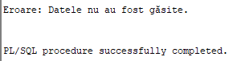

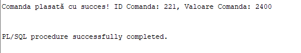

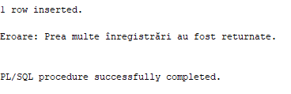

## Trigger de tip LMD la nivel de comanda

Definesc un trigger de tip LMD la nivel de comanda care inregistreaza intr-un table nou numit LOG_AUDIT_COMENZI tipul de modificare precum si alte informatii de comanda modificata, stearsa sau inserata.

| CREATE TABLE LOG_AUDIT_COMENZI (  actiune VARCHAR2(10),  timestamp TIMESTAMP ); CREATE OR REPLACE TRIGGER trg_lmd_comanda AFTER INSERT OR UPDATE OR DELETE ON COMANDA DECLARE  v_action VARCHAR2(10); BEGIN  IF INSERTING THEN  v_action := 'INSERT';  ELSIF UPDATING THEN  v_action := 'UPDATE';  ELSIF DELETING THEN  v_action := 'DELETE';  END IF;  INSERT INTO LOG_AUDIT_COMENZI (actiune, timestamp)  VALUES (v_action, SYSTIMESTAMP); END trg_lmd_comanda; / INSERT INTO COMANDA (id_comanda, id_client, numar_produse, data, valoare) VALUES (207, 203, 3, SYSDATE, 3000.00); UPDATE COMANDA SET numar_produse = 4 WHERE id_comanda = 303; UPDATE COMANDA SET numar_produse = 4 WHERE id_comanda = 304;  select \* from LOG_AUDIT_COMENZI |
|---------------------------------------------------------------------------------------------------------------------------------------------------------------------------------------------------------------------------------------------------------------------------------------------------------------------------------------------------------------------------------------------------------------------------------------------------------------------------------------------------------------------------------------------------------------------------------------------------------------------------------------------------------------------------------------------------------------------------------------------------|

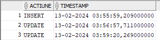

## Trigger de tip LMD la nivel de linie

Acest trigger, denumit livrare_date_check, este conceput pentru a verifica și preveni actualizările sau inserările în tabela LIVRARE, asigurând că data livrării nu poate fi setată în viitor. În cazul în care o astfel de condiție este încălcată, se generează o intrare într-un jurnal de erori și se declanșează o excepție cu un cod de eroare specific (-20009) și un mesaj corespunzător.

| CREATE SEQUENCE error_log_sequence START WITH 1 INCREMENT BY 1;  CREATE OR REPLACE TRIGGER livrare_date_check  BEFORE UPDATE OR INSERT  ON LIVRARE  FOR EACH ROW DECLARE  v_current_date DATE; BEGIN  SELECT SYSDATE INTO v_current_date FROM DUAL;   IF (:NEW.data \> v_current_date) THEN  INSERT INTO error_log(id_error_log, error_code, error_message)  VALUES (error_log_sequence.NEXTVAL, -20009, 'Data livrarii nu poate fi in viitor');  RAISE_APPLICATION_ERROR(-20009, 'Data livrarii nu poate fi in viitor');  END IF; END; /  INSERT INTO LIVRARE (id_livrator, id_client, data) VALUES (1, 2, SYSDATE + INTERVAL '1' DAY);  UPDATE LIVRARE  SET data = SYSDATE + INTERVAL '3' DAY WHERE id_livrator = 401 AND id_client = 201; |
|----------------------------------------------------------------------------------------------------------------------------------------------------------------------------------------------------------------------------------------------------------------------------------------------------------------------------------------------------------------------------------------------------------------------------------------------------------------------------------------------------------------------------------------------------------------------------------------------------------------------------------------------------------------------------------------------------------------------------------------------|

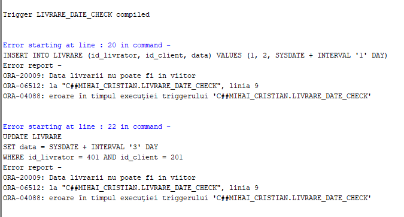

## Trigger de tip LDD

Trigger-ul ldd_audit_trigger înregistrează evenimentele CREATE, ALTER și DROP care apar în schema bazei de date, stocând informații relevante precum marca temporală, numele utilizatorului și detaliile despre acțiunea efectuată în tabela ldd_audit.

| CREATE TABLE ldd_audit (  marca_temporală TIMESTAMP,  nume_utilizator VARCHAR2(150),  tip_comandă VARCHAR2(50),  tip_obiect VARCHAR2(50),  nume_obiect Varchar2(100) );  CREATE OR REPLACE TRIGGER ldd_audit_trigger  AFTER CREATE OR ALTER OR DROP  ON SCHEMA BEGIN  INSERT INTO ldd_audit  VALUES (SYSTIMESTAMP, USER, ORA_SYSEVENT, ORA_DICT_OBJ_TYPE, ORA_DICT_OBJ_NAME); END; /  CREATE TABLE test (  id NUMĂR );  ALTER TABLE test ADD CONSTRAINT test_pk PRIMARY KEY (id); DROP TABLE test;  SELECT \* FROM LDD_AUDIT; |
|-------------------------------------------------------------------------------------------------------------------------------------------------------------------------------------------------------------------------------------------------------------------------------------------------------------------------------------------------------------------------------------------------------------------------------------------------------------------------------------------------------------------------------|

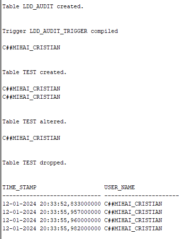

## Pachet care continue toate obiectele definite in cadrul proiectului

| CREATE OR REPLACE PACKAGE my_project_pkg AS  PROCEDURE GetAllDepotInventory;  PROCEDURE GetCustomerOrders(p_start_date DATE, p_end_date DATE);  PROCEDURE plaseaza_comanda(p_id_client INT, p_denumire_produs VARCHAR2, p_cantitate INT);  FUNCTION GetCustomerOrderDetails(p_client_id INT) RETURN VARCHAR2; END my_project_pkg; /  CREATE OR REPLACE PACKAGE BODY my_project_pkg AS  PROCEDURE GetAllDepotInventory AS  TYPE ProductCountIndexByTable IS TABLE OF INT INDEX BY VARCHAR2(255);  TYPE ProductListNestedTable IS TABLE OF VARCHAR2(255);  TYPE StockVarray IS VARRAY(10) OF INT;  TYPE DepotInfoRecord IS RECORD (  DepotId INT,  ProductCount INT,  Products ProductListNestedTable,  Stocks StockVarray  );  TYPE DepotInfoTable IS TABLE OF DepotInfoRecord;  DepotsInfo DepotInfoTable := DepotInfoTable();  CursorDepots SYS_REFCURSOR;  DepotRec DepotInfoRecord;  BEGIN  OPEN CursorDepots FOR  SELECT DISTINCT id_depozit FROM MODEL_PRODUS;  LOOP  FETCH CursorDepots INTO DepotRec.DepotId;  EXIT WHEN CursorDepots%NOTFOUND;  DepotRec.Products := ProductListNestedTable();  DepotRec.Stocks := StockVarray();  SELECT COUNT(\*)  INTO DepotRec.ProductCount  FROM MODEL_PRODUS  WHERE id_depozit = DepotRec.DepotId;  FOR ProductRec IN (SELECT denumire FROM MODEL_PRODUS WHERE id_depozit = DepotRec.DepotId) LOOP  DepotRec.Products.EXTEND;  DepotRec.Products(DepotRec.Products.LAST) := ProductRec.denumire;  END LOOP;  FOR StockRec IN (SELECT stoc FROM MODEL_PRODUS WHERE id_depozit = DepotRec.DepotId) LOOP  DepotRec.Stocks.EXTEND;  DepotRec.Stocks(DepotRec.Stocks.LAST) := StockRec.stoc;  END LOOP;  DepotsInfo.EXTEND;  DepotsInfo(DepotsInfo.LAST) := DepotRec;  END LOOP;  CLOSE CursorDepots;  FOR i IN 1..DepotsInfo.COUNT LOOP  DBMS_OUTPUT.PUT_LINE('Depozit: ' \|\| DepotsInfo(i).DepotId);  DBMS_OUTPUT.PUT_LINE('Număr total de produse în depozit: ' \|\| DepotsInfo(i).ProductCount);  FOR j IN 1..DepotsInfo(i).Products.COUNT LOOP  DBMS_OUTPUT.PUT_LINE('Produs: ' \|\| DepotsInfo(i).Products(j) \|\| ', Stoc: ' \|\| DepotsInfo(i).Stocks(j));  END LOOP;  DBMS_OUTPUT.PUT_LINE('');  END LOOP;  END GetAllDepotInventory;   PROCEDURE GetCustomerOrders(p_start_date DATE, p_end_date DATE) AS  CURSOR CustomerCursor IS  SELECT id_client, nume, prenume  FROM CLIENT;  CURSOR OrderCursor (v_client_id INT) IS  SELECT id_comanda, numar_produse, data, valoare  FROM COMANDA  WHERE id_client = v_client_id  AND data BETWEEN p_start_date AND p_end_date;  v_client_id INT;  v_client_name VARCHAR2(255);  v_client_surname VARCHAR2(255);  v_order_id INT;  v_order_products INT;  v_order_date DATE;  v_order_value DECIMAL(10, 2);  BEGIN  FOR CustomerRec IN CustomerCursor LOOP  v_client_id := CustomerRec.id_client;  v_client_name := CustomerRec.nume;  v_client_surname := CustomerRec.prenume;  DBMS_OUTPUT.PUT_LINE('Detalii pentru clientul cu ID ' \|\| v_client_id \|\| ': ' \|\| v_client_name \|\| ' ' \|\| v_client_surname);  OPEN OrderCursor(v_client_id);  FETCH OrderCursor INTO v_order_id, v_order_products, v_order_date, v_order_value;  IF OrderCursor%NOTFOUND THEN  DBMS_OUTPUT.PUT_LINE('Nicio comandă în intervalul specificat.');  ELSE  LOOP  DBMS_OUTPUT.PUT_LINE('Comanda ID: ' \|\| v_order_id \|\| ', Produse: ' \|\| v_order_products \|\| ', Data: ' \|\| v_order_date \|\| ', Valoare: ' \|\| v_order_value);  FETCH OrderCursor INTO v_order_id, v_order_products, v_order_date, v_order_value;  EXIT WHEN OrderCursor%NOTFOUND;  END LOOP;  END IF;  CLOSE OrderCursor;  DBMS_OUTPUT.PUT_LINE('');  END LOOP;  END GetCustomerOrders;   PROCEDURE plaseaza_comanda(p_id_client INT, p_denumire_produs VARCHAR2, p_cantitate INT) AS  v_id_locatie INT;  v_stoc_disponibil INT;  v_id_comanda INT;  v_pret_unitar DECIMAL(10, 2);  v_valoare DECIMAL(10, 2);  BEGIN  SELECT dp.id_locatie  INTO v_id_locatie  FROM MODEL_PRODUS mp  JOIN DEPOZIT dp ON mp.id_depozit = dp.id_depozit  WHERE mp.denumire = p_denumire_produs;  SELECT stoc, pret  INTO v_stoc_disponibil, v_pret_unitar  FROM MODEL_PRODUS  WHERE denumire = p_denumire_produs;  IF v_stoc_disponibil \>= p_cantitate THEN  UPDATE MODEL_PRODUS  SET stoc = stoc - p_cantitate  WHERE denumire = p_denumire_produs;  v_valoare := p_cantitate \* v_pret_unitar;  SELECT seq_comanda.NEXTVAL INTO v_id_comanda FROM DUAL;  INSERT INTO COMANDA (id_comanda, id_client, numar_produse, data, valoare)  VALUES (v_id_comanda, p_id_client, p_cantitate, SYSDATE, v_valoare);  INSERT INTO PRODUS_CUPRINS (id_comanda, id_model_produs)  VALUES (v_id_comanda, (SELECT id_model_cuprins FROM MODEL_PRODUS WHERE denumire = p_denumire_produs));  DBMS_OUTPUT.PUT_LINE('Comanda plasată cu succes! ID Comanda: ' \|\| v_id_comanda \|\| ', Valoare Comanda: ' \|\| v_valoare);  ELSE  DBMS_OUTPUT.PUT_LINE('Stoc insuficient pentru a plasa comanda. Stoc disponibil: ' \|\| v_stoc_disponibil);  END IF;  EXCEPTION  WHEN NO_DATA_FOUND THEN  DBMS_OUTPUT.PUT_LINE('Eroare: Datele nu au fost găsite.');  WHEN TOO_MANY_ROWS THEN  DBMS_OUTPUT.PUT_LINE('Eroare: Prea multe înregistrări au fost returnate.');  WHEN OTHERS THEN  DBMS_OUTPUT.PUT_LINE('Eroare: ' \|\| SQLERRM);  END plaseaza_comanda;   FUNCTION GetCustomerOrderDetails(p_client_id INT) RETURN VARCHAR2 AS  v_total_value DECIMAL(10, 2);  v_last_order_details VARCHAR2(4000);  NoOrdersException EXCEPTION;  PRAGMA EXCEPTION_INIT(NoOrdersException, -20001);  NoCustomerException EXCEPTION;  PRAGMA EXCEPTION_INIT(NoCustomerException, -20003);  BEGIN  SELECT COUNT(\*)  INTO v_total_value  FROM CLIENT  WHERE id_client = p_client_id;  IF v_total_value = 0 THEN  RAISE_APPLICATION_ERROR(-20003, 'Nu există client cu ID-ul specificat.');  END IF;  SELECT NVL(SUM(c.valoare), 0),   MAX('Ultima comanda:' \|\| CHR(10) \|\| 'Comanda ID: ' \|\| c.id_comanda \|\| ', Produse: ' \|\| c.numar_produse \|\| ', Data: ' \|\| TO_CHAR(c.data, 'DD-MM-YYYY')) \|\|  CHR(10) \|\| 'Produse cumparate: ' \|\| CHR(10) \|\|  LISTAGG('Produs: ' \|\| mp.denumire \|\| ', Producator: ' \|\| mp.producator \|\| ', Pret: ' \|\| TO_CHAR(mp.pret, 'FM9999.99'), CHR(10)) WITHIN GROUP (ORDER BY pc.id_comanda)  INTO v_total_value, v_last_order_details  FROM COMANDA c  JOIN PRODUS_CUPRINS pc ON c.id_comanda = pc.id_comanda  JOIN MODEL_PRODUS mp ON pc.id_model_produs = mp.id_model_cuprins  WHERE c.id_client = p_client_id;  IF v_total_value = 0 THEN  RAISE_APPLICATION_ERROR(-20001, 'Clientul nu a făcut nicio comandă.');  END IF;  RETURN 'Valoarea totală a comenzilor: ' \|\| TO_CHAR(v_total_value) \|\| CHR(10) \|\| v_last_order_details;  EXCEPTION  WHEN NoOrdersException THEN  RETURN 'Eroare: ' \|\| SQLERRM;  WHEN NoCustomerException THEN  RETURN 'Eroare: ' \|\| SQLERRM;  WHEN OTHERS THEN  RETURN 'Eroare nedefinită: ' \|\| SQLERRM;  END GetCustomerOrderDetails;  END my_project_pkg; /  BEGIN  my_project_pkg.GetAllDepotInventory; END; /  BEGIN  my_project_pkg.GetCustomerOrders('01-01-2024', '31-01-2024'); END; /  DECLARE  v_result VARCHAR2(4000); BEGIN  v_result := my_project_pkg.GetCustomerOrderDetails(201);  DBMS_OUTPUT.PUT_LINE('Rezultat 1: ' \|\| v_result); END; / |
|--------------------------------------------------------------------------------------------------------------------------------------------------------------------------------------------------------------------------------------------------------------------------------------------------------------------------------------------------------------------------------------------------------------------------------------------------------------------------------------------------------------------------------------------------------------------------------------------------------------------------------------------------------------------------------------------------------------------------------------------------------------------------------------------------------------------------------------------------------------------------------------------------------------------------------------------------------------------------------------------------------------------------------------------------------------------------------------------------------------------------------------------------------------------------------------------------------------------------------------------------------------------------------------------------------------------------------------------------------------------------------------------------------------------------------------------------------------------------------------------------------------------------------------------------------------------------------------------------------------------------------------------------------------------------------------------------------------------------------------------------------------------------------------------------------------------------------------------------------------------------------------------------------------------------------------------------------------------------------------------------------------------------------------------------------------------------------------------------------------------------------------------------------------------------------------------------------------------------------------------------------------------------------------------------------------------------------------------------------------------------------------------------------------------------------------------------------------------------------------------------------------------------------------------------------------------------------------------------------------------------------------------------------------------------------------------------------------------------------------------------------------------------------------------------------------------------------------------------------------------------------------------------------------------------------------------------------------------------------------------------------------------------------------------------------------------------------------------------------------------------------------------------------------------------------------------------------------------------------------------------------------------------------------------------------------------------------------------------------------------------------------------------------------------------------------------------------------------------------------------------------------------------------------------------------------------------------------------------------------------------------------------------------------------------------------------------------------------------------------------------------------------------------------------------------------------------------------------------------------------------------------------------------------------------------------------------------------------------------------------------------------------------------------------------------------------------------------------------------------------------------------------------------------------------------------------------------------------------------------------------------------------------------------------------------------------------------------------------------------------------------------------------------------------------------------------------------------------------------------------------------------------------------------------------------------------------------------------------------------------------------------------------------------------------------------------------------------------------------------------------------------------------------------------------------------------------------------------------------------------------------------------------------------------------------------------------------------------------------------------------------------------------------------------------------------------------------------------------------------------------------------------------------------------------------------------------------------------------------------------------------------------------------------------------------------------------------------------------------------------------------------------------------------------------------------------------------------------------------------------------------------------------------------------------------------------------------------------------------------------------------------------------------------------------------------------------------------------------------------------------------------------------------------------------------------------------------------------------------------------------------------------------------------------------------------------------------------------------------------------------------------------------------------------------------------------------------------------------------------------------------------------------------------------------------------------------------------------------------------------------------------------------------------------------------------------------------------------------------------------------------------------------------------------------------------------------------------------------------------------------------------------------------------------------------------------------------------------------------------------------------------------------------------------------------------------------------------------------------------------------------------------------------------------------------------------------------------------------------------------------------------------------------------------------------------------------------------------------------------------------------------------------------------------------------------------------------------------------------------------------------------------------------------------------------------------------------------------------------------------------------------------------|

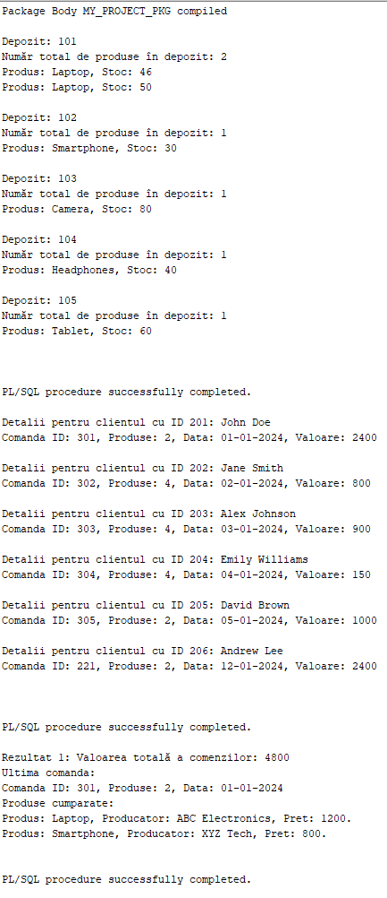
